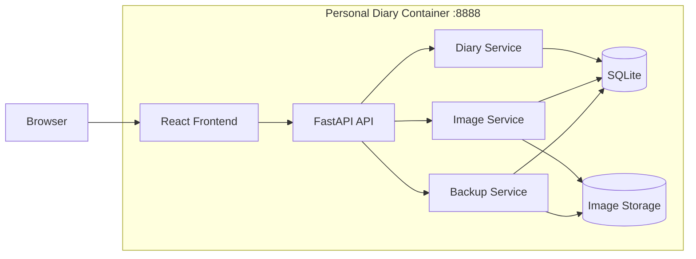
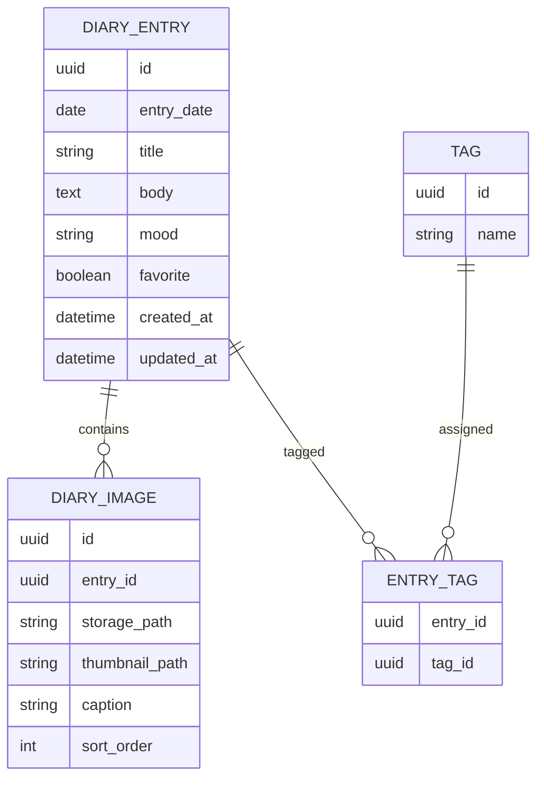

# GREENFIELD PROJECT PROMPT
# Personal Diary — Local-First Calendar Journal

You are building a completely new application from scratch.

Treat this as a **greenfield repository**.

Do not assume:
- any existing source code,
- any existing infrastructure,
- any existing database,
- any existing frontend,
- any existing authentication system,
- any cloud service,
- any external storage,
- or any previously configured development environment.

Everything required to build, run, test, maintain, back up, and understand the application must live inside this repository.

---

# 1. PROJECT NAME

Use:

```text
personal_diary
```

Suggested product display name:

```text
My Diary
```

The application is a **private, local-first personal diary/journal**.

It must run completely locally using Docker and must be accessible at:

```text
http://localhost:8888
```

The application must continue working without Internet access after the Docker images/dependencies have been built.

---

# 2. PRIMARY PRODUCT IDEA

Build a beautiful personal diary application where a user can document their life day by day.

The primary interface is a **calendar**.

Each calendar date represents a potential diary entry.

A user should be able to:

- navigate through years and months,
- select any date,
- write diary entries for that date,
- attach multiple images,
- edit previous entries,
- remove entries,
- preview images,
- search the diary,
- browse days visually through the calendar,
- see which dates contain entries,
- see which dates contain images,
- see short entry previews,
- optionally assign mood/tags,
- browse entries chronologically,
- and export/backup their diary.

This should feel like a polished personal product rather than a CRUD demonstration.

---

# 3. CORE DESIGN PRINCIPLE

The central mental model is:

```text
Calendar
    ↓
Day
    ↓
Diary Entry
    ├── Text
    ├── Images
    ├── Mood
    ├── Tags
    ├── Metadata
    └── Optional location/weather notes
```

The calendar is the application's home page.

Do NOT make the home page a generic list of journal entries.

The user should immediately see their life represented as a calendar.

---

# 4. PRIMARY USER

Initial version is intended for:

```text
Single local user
```

Do not build multi-tenancy.

Do not require:

- Google login,
- social login,
- OAuth,
- cloud account,
- external API account.

An optional local password/PIN lock can be supported, but it must not complicate the core implementation.

---

# 5. TARGET DEPLOYMENT

The entire application must run using Docker.

Minimum startup command:

```bash
docker compose up -d --build
```

After startup:

```text
http://localhost:8888
```

must open the application.

The host port MUST be:

```text
8888
```

Internal container ports may differ if necessary.

---

# 6. LOCAL-FIRST REQUIREMENT

The diary contains private personal information.

Therefore:

- no telemetry,
- no analytics sent outside the machine,
- no cloud storage,
- no external image hosting,
- no third-party tracking,
- no remote database,
- no CDN dependency at runtime,
- no external font requirement at runtime.

All application data must remain on the local machine.

The application must remain usable when Internet connectivity is unavailable.

---

# 7. RECOMMENDED TECHNOLOGY STACK

Use a modern but maintainable stack.

## Backend

```text
Python 3.12+
FastAPI
SQLAlchemy 2.x
Pydantic
Alembic
```

## Database

For this local single-user application:

```text
SQLite
```

is preferred.

Use SQLite in WAL mode where appropriate.

Database path should live inside persistent Docker storage:

```text
/data/diary.db
```

Do NOT introduce PostgreSQL unless there is a compelling technical need.

The application should remain simple to back up.

---

# 8. FRONTEND

Preferred frontend:

```text
React
TypeScript
Vite
```

Recommended libraries:

```text
React Router
TanStack Query
date-fns
Lucide Icons
```

For UI styling choose ONE cohesive solution, for example:

```text
Tailwind CSS
```

with thoughtfully designed reusable components.

Do not produce a collection of unstyled HTML controls.

The finished application should look like a polished modern consumer product.

---

# 9. DEPLOYMENT ARCHITECTURE

Prefer a production-style single application container.

Conceptually:

```text
Browser
   │
   │ http://localhost:8888
   ▼
┌──────────────────────────────────────┐
│ Personal Diary Docker Container      │
│                                      │
│  ┌──────────────────────────────┐    │
│  │ React Frontend               │    │
│  └───────────────┬──────────────┘    │
│                  │ /api              │
│  ┌───────────────▼──────────────┐    │
│  │ FastAPI Backend              │    │
│  └───────────────┬──────────────┘    │
│                  │                   │
│        ┌─────────┴─────────┐         │
│        ▼                   ▼         │
│   SQLite DB           Image Files    │
│   /data/diary.db      /data/images   │
│                                      │
└──────────────────────────────────────┘
                  │
                  ▼
        Docker persistent volume
```

The frontend and backend may be built separately during compilation, but deployment should be straightforward.

Prefer the FastAPI service to serve the compiled frontend if practical.

---

# 10. DATA PERSISTENCE

All important user data must survive:

```bash
docker compose down
docker compose up -d
```

and container recreation.

Use a persistent Docker volume or documented bind mount.

Suggested structure:

```text
/data/
├── diary.db
├── images/
├── thumbnails/
├── backups/
└── exports/
```

Never store persistent diary data exclusively inside the ephemeral container filesystem.

---

# 11. MAIN APPLICATION SCREEN

The main application screen should be the calendar.

Desktop layout suggestion:

```text
┌─────────────────────────────────────────────────────────────────┐
│ My Diary     Search                Today       Settings      ☾   │
├─────────────────────────────────────────────────────────────────┤
│                                                                 │
│  ‹     October 2026     ›                       Year / Month     │
│                                                                 │
│  SUN    MON    TUE    WED    THU    FRI    SAT                  │
│ ┌─────┬─────┬─────┬─────┬─────┬─────┬─────┐                   │
│ │     │     │     │     │  1  │  2  │  3  │                   │
│ │     │     │     │     │ •   │ 📷  │     │                   │
│ ├─────┼─────┼─────┼─────┼─────┼─────┼─────┤                   │
│ │  4  │  5  │  6  │  7  │  8  │  9  │ 10  │                   │
│ │ 😊  │     │ •   │ •📷 │     │     │     │                   │
│ ...                                                             │
│                                                                 │
└─────────────────────────────────────────────────────────────────┘
```

Dates containing entries must be visually distinguishable.

A date cell may display:

- entry indicator,
- image indicator,
- mood indicator,
- first image thumbnail,
- short text preview,
- tag colors,
- or combinations thereof.

Keep the design elegant rather than overcrowded.

---

# 12. CALENDAR MODES

Implement at least:

```text
Month View
Year View
```

Optional future extension:

```text
Week View
```

Month view is the primary experience.

---

# 13. MONTH VIEW

Month view must support:

- previous month,
- next month,
- jump to today,
- month/year picker,
- keyboard navigation where sensible,
- dates from adjacent months rendered subtly,
- highlight current day,
- highlight selected day,
- visual indicator for dates containing entries.

Each date tile should be clickable.

---

# 14. YEAR VIEW

Year view should display all 12 months compactly.

Example:

```text
2026

Jan    Feb    Mar
Apr    May    Jun
Jul    Aug    Sep
Oct    Nov    Dec
```

Days containing entries can be marked using subtle dots or intensity indicators.

Clicking a date opens that date.

Clicking a month transitions to month view.

---

# 15. DAY VIEW

When a date is selected, show a dedicated diary experience.

Example layout:

```text
Friday
October 2, 2026

────────────────────────────────────

How was your day?

[ Mood ]

[ diary editor........................ ]
[ .................................... ]
[ .................................... ]

Tags:
[Family] [Work] [+ Add]

Photos
┌──────────┐ ┌──────────┐ ┌──────────┐
│          │ │          │ │          │
│ photo    │ │ photo    │ │    +     │
│          │ │          │ │ Add Photo│
└──────────┘ └──────────┘ └──────────┘

                              [Save]
```

---

# 16. ENTRY MODEL

One date should normally have one principal diary record.

Use local calendar date as the logical unique diary date.

Example:

```text
2026-10-02
```

Suggested entry fields:

```text
id
entry_date
title
body
mood
created_at
updated_at
favorite
word_count
```

Potential schema:

```python
DiaryEntry:
    id: UUID
    entry_date: date
    title: Optional[str]
    body: str
    mood: Optional[str]
    favorite: bool
    created_at: datetime
    updated_at: datetime
```

Enforce one canonical diary record per date unless the architecture intentionally supports diary sections within a date.

---

# 17. TEXT EDITOR

The diary editor is central.

Support:

- multiline text,
- paragraphs,
- Unicode,
- emoji,
- copy/paste,
- undo/redo,
- autosizing input,
- markdown-like or rich-text behavior if implemented cleanly.

Preferred initial design:

```text
Markdown-compatible plain text
```

or a lightweight rich-text editor.

Avoid complex proprietary editor dependencies.

A user's written content must never be lost because of a frontend refresh whenever preventable.

---

# 18. AUTOSAVE

Implement draft autosave.

When text changes:

```text
Saved just now
```

or:

```text
Saving...
```

may appear discreetly.

Suggested debounce:

```text
500–1500 ms
```

The backend should safely update the diary entry.

Do not send a request for every keystroke.

---

# 19. TITLE

Diary entries may have an optional title.

Example:

```text
A wonderful evening with family
```

Title should NOT be mandatory.

The default user experience should remain frictionless.

---

# 20. IMAGES

Each diary date must support multiple image uploads.

Supported initial formats:

```text
JPEG
PNG
WebP
HEIC/HEIF if practical
```

If HEIC support significantly complicates portability, document that limitation rather than producing unstable implementation.

---

# 21. IMAGE STORAGE

Do NOT store raw images as base64 blobs inside SQLite.

Store:

```text
image metadata → database
image bytes → filesystem
```

Example:

```text
/data/images/
    2026/
        10/
            02/
                <uuid>.jpg
                <uuid>.png
```

Never depend solely on the original client filename.

Generate collision-safe identifiers.

---

# 22. IMAGE DATABASE MODEL

Suggested:

```text
DiaryImage
---------
id
entry_id
filename
original_filename
mime_type
size_bytes
width
height
sha256
caption
sort_order
created_at
```

The database stores relative storage paths.

Never store host-specific absolute filesystem paths.

---

# 23. IMAGE SECURITY

Uploaded files must be validated.

Validate:

- MIME type,
- extension,
- actual image parsing,
- maximum size,
- maximum dimensions where appropriate.

Reject executable or unknown content.

Sanitize original filenames before displaying them.

Never use user filenames directly as filesystem paths.

---

# 24. IMAGE SIZE LIMIT

Make configurable.

Example default:

```text
25 MB per image
```

Configuration:

```text
MAX_IMAGE_SIZE_MB=25
```

---

# 25. THUMBNAILS

Generate thumbnails server-side.

Example:

```text
/data/thumbnails/
```

At least one optimized thumbnail size:

```text
512px max dimension
```

Calendar cards should use thumbnails rather than full-resolution photos.

---

# 26. IMAGE METADATA

Where available, safely extract:

```text
width
height
format
EXIF capture date
orientation
```

Honor EXIF rotation.

Do not automatically expose sensitive GPS metadata.

Optionally provide a setting to strip EXIF metadata from stored images.

---

# 27. PHOTO GALLERY

Within a day view:

- show photos in an elegant responsive gallery,
- click to open full-screen lightbox,
- support previous/next photo,
- support image captions,
- allow reorder,
- allow delete with confirmation.

Optional:

```text
drag-and-drop reorder
```

---

# 28. DRAG AND DROP

Allow users to add images via:

- file picker,
- drag and drop,
- paste from clipboard where browser support allows.

Provide clear upload progress.

---

# 29. CALENDAR IMAGE PREVIEW

If a day contains images, calendar cells may display:

```text
first image thumbnail
```

behind or alongside the date metadata.

However, do not make the calendar visually chaotic.

Provide user settings such as:

```text
Show photo thumbnails in calendar: ON/OFF
```

---

# 30. MOOD TRACKING

Allow an optional daily mood.

Keep it simple.

Example:

```text
😄 Great
🙂 Good
😐 Okay
😔 Low
😢 Difficult
```

Mood is optional.

The diary must remain useful without entering mood data.

Do not frame mood tracking as medical assessment.

---

# 31. TAGS

Allow users to create reusable tags.

Example:

```text
Family
Work
Travel
Friends
Ideas
Health
Learning
Vacation
Celebration
```

An entry can have many tags.

A tag can belong to many entries.

Suggested models:

```text
Tag
EntryTag
```

---

# 32. FAVORITES

Allow users to mark entries as favorites.

Favorite entries should be discoverable through filtering.

---

# 33. SEARCH

Implement full diary search.

Search should include:

```text
title
body text
tags
image captions
```

For SQLite consider:

```text
SQLite FTS5
```

if supported cleanly.

Otherwise provide indexed case-insensitive search.

---

# 34. SEARCH EXPERIENCE

Global search bar should return results similar to:

```text
Search: "birthday"

Oct 14, 2026
Dad's birthday
"...wonderful dinner together..."

Aug 19, 2026
Birthday preparation
"...picked up the cake..."
```

Selecting a result opens the correct diary date.

---

# 35. SEARCH FILTERS

Support filters such as:

```text
Date range
Tag
Mood
Favorites
Has images
Has text
Year
Month
```

Do not overload the initial interface; use a filter drawer/modal.

---

# 36. TIMELINE VIEW

In addition to calendar, provide a chronological timeline.

Example:

```text
October 2026

02 OCT
A wonderful Friday
[preview text]
[photo] [photo]

01 OCT
Started the new project...
```

Timeline should be secondary to calendar.

---

# 37. EMPTY DAY EXPERIENCE

Clicking a date with no diary entry should immediately allow creation.

Example:

```text
October 5, 2026

Nothing written yet.

What happened today?

[ Start writing... ]
```

Avoid unnecessary "Create Entry" modal steps.

---

# 38. HISTORICAL DATES

The user must be able to write entries for past dates.

The user may also write a future note if desired.

Do not restrict entry creation to today's date.

---

# 39. DATE HANDLING

Store diary identity using:

```text
DATE
```

rather than timestamp.

Timestamps such as:

```text
created_at
updated_at
```

may use UTC internally.

The diary's logical day must not unexpectedly shift because of timezone conversions.

Default configurable timezone:

```text
Asia/Kolkata
```

but support other timezone values through configuration.

---

# 40. HOME PAGE INFORMATION

Calendar page may contain subtle statistics:

```text
12 entries this month
34 photos
6-day writing streak
```

Streaks should be informational, not gamified aggressively.

---

# 41. "ON THIS DAY"

Provide an optional feature:

```text
On This Day
```

Example:

```text
October 2

1 year ago
2 years ago
5 years ago
```

This becomes valuable as historical data grows.

Do not show the feature if no prior entries exist for that date.

---

# 42. RECENT ENTRIES

Optional sidebar/card:

```text
Recently Updated
```

Show several recently edited diary dates.

---

# 43. NAVIGATION

Suggested primary navigation:

```text
Calendar
Timeline
Search
Photos
Tags
Favorites
Settings
```

Keep navigation elegant and minimal.

---

# 44. PHOTO LIBRARY VIEW

Provide a page showing diary photographs chronologically.

Example:

```text
Photos

October 2026
[ ][ ][ ][ ]
[ ][ ][ ][ ]

September 2026
[ ][ ][ ]
```

Selecting a photo should reveal:

```text
date
caption
associated diary entry
```

and allow opening that diary date.

---

# 45. TAG BROWSER

Provide:

```text
Tags
```

with counts.

Example:

```text
Family      93
Travel      41
Work        38
Ideas       27
```

Clicking a tag filters relevant entries.

---

# 46. FAVORITES VIEW

Provide a visually appealing list of favorite diary memories.

---

# 47. SETTINGS

Settings should include at least:

## Appearance

```text
Theme:
- Light
- Dark
- System

Calendar photo previews
Compact/comfortable density
```

## Diary

```text
Week starts:
- Sunday
- Monday

Timezone
Date format
```

## Images

```text
Thumbnail generation
EXIF handling
Upload size limit display
```

## Backup

```text
Export Diary
Import Diary
Create Backup
```

## Privacy

```text
Optional local lock
Auto-lock interval
```

---

# 48. DARK MODE

Implement a high-quality dark mode.

Do not merely invert colors.

Ensure:

- correct contrast,
- readable diary text,
- subdued calendar borders,
- elegant surfaces,
- accessible controls.

---

# 49. RESPONSIVE DESIGN

The application must work well on:

```text
Desktop
Laptop
Tablet
Mobile browser
```

Desktop should feel spacious.

Mobile calendar should remain useful rather than becoming an unusable compressed desktop view.

Possible mobile behavior:

```text
calendar month
↓
tap day
↓
full-screen day editor
```

---

# 50. VISUAL DESIGN DIRECTION

Target qualities:

```text
calm
private
warm
minimal
premium
reflective
personal
modern
```

Avoid:

```text
enterprise dashboard aesthetic
admin-panel appearance
heavy gradients everywhere
excessively colorful cards
dense tables
generic Bootstrap-looking UI
```

Think of a private digital notebook combined with a modern calendar and photo journal.

---

# 51. TYPOGRAPHY

Use system or bundled/open fonts that do not require external network resources.

Diary body typography should emphasize reading comfort.

Suggested visual hierarchy:

```text
Date
Entry title
Diary content
Metadata
```

---

# 52. ACCESSIBILITY

Support basic WCAG practices:

- semantic HTML,
- keyboard navigation,
- visible focus indicators,
- form labels,
- adequate contrast,
- image alt/caption support,
- meaningful buttons,
- accessible dialogs.

---

# 53. DATABASE SCHEMA

At minimum create tables equivalent to:

```text
diary_entries
diary_images
tags
entry_tags
settings
```

Optional:

```text
entry_revisions
backup_history
```

---

# 54. SUGGESTED SCHEMA

## diary_entries

```text
id UUID PRIMARY KEY
entry_date DATE UNIQUE NOT NULL
title TEXT
body TEXT NOT NULL DEFAULT ''
mood TEXT
favorite BOOLEAN NOT NULL DEFAULT FALSE
created_at DATETIME NOT NULL
updated_at DATETIME NOT NULL
```

Indexes:

```text
entry_date
updated_at
favorite
mood
```

---

# 55. diary_images

```text
id UUID PRIMARY KEY
entry_id UUID NOT NULL
storage_path TEXT NOT NULL
thumbnail_path TEXT
original_filename TEXT
mime_type TEXT NOT NULL
size_bytes INTEGER
width INTEGER
height INTEGER
sha256 TEXT
caption TEXT
sort_order INTEGER NOT NULL DEFAULT 0
created_at DATETIME NOT NULL
```

Index:

```text
entry_id
sha256
created_at
```

---

# 56. tags

```text
id UUID PRIMARY KEY
name TEXT UNIQUE NOT NULL
created_at DATETIME NOT NULL
```

---

# 57. entry_tags

```text
entry_id
tag_id
```

Composite unique constraint:

```text
(entry_id, tag_id)
```

---

# 58. DATABASE MIGRATIONS

Use:

```text
Alembic
```

Database migrations must automatically run safely during container startup or through a well-documented command.

Never require manual SQL setup for normal startup.

---

# 59. BACKEND API

Use REST under:

```text
/api/v1
```

Suggested endpoints.

---

# 60. HEALTH

```http
GET /api/v1/health
```

Example:

```json
{
  "status": "healthy",
  "database": "ok",
  "storage": "ok"
}
```

---

# 61. CALENDAR API

```http
GET /api/v1/calendar/2026/10
```

Return lightweight metadata only.

Example:

```json
{
  "year": 2026,
  "month": 10,
  "days": {
    "2026-10-02": {
      "has_entry": true,
      "has_images": true,
      "image_count": 3,
      "mood": "good",
      "title": "A wonderful evening"
    }
  }
}
```

Do not return entire full-resolution diary bodies/images for every calendar cell.

---

# 62. ENTRY API

```http
GET /api/v1/entries/{date}
PUT /api/v1/entries/{date}
DELETE /api/v1/entries/{date}
```

Potential additional endpoints:

```http
GET /api/v1/entries
GET /api/v1/entries/recent
GET /api/v1/entries/favorites
```

---

# 63. CREATE/UPDATE PAYLOAD

Example:

```json
{
  "title": "A beautiful Saturday",
  "body": "Today we...",
  "mood": "great",
  "favorite": true,
  "tags": [
    "Family",
    "Weekend"
  ]
}
```

---

# 64. IMAGE API

Suggested:

```http
POST   /api/v1/entries/{date}/images
GET    /api/v1/images/{image_id}
GET    /api/v1/images/{image_id}/thumbnail
PATCH  /api/v1/images/{image_id}
DELETE /api/v1/images/{image_id}
POST   /api/v1/entries/{date}/images/reorder
```

---

# 65. SEARCH API

```http
GET /api/v1/search?q=...
```

Filters may include:

```text
from
to
tag
mood
favorite
has_images
```

---

# 66. TAG API

```http
GET    /api/v1/tags
POST   /api/v1/tags
PATCH  /api/v1/tags/{id}
DELETE /api/v1/tags/{id}
```

Deleting a tag must not delete diary entries.

---

# 67. STATS API

Optional:

```http
GET /api/v1/stats
```

Potential response:

```json
{
  "entries": 413,
  "images": 1287,
  "words": 192341,
  "first_entry": "2024-01-01",
  "current_streak": 8
}
```

---

# 68. BACKUP SYSTEM

This is critical.

A personal diary must be easy to back up.

Provide:

```text
Create Backup
```

The generated backup should contain:

```text
database
images
configuration needed for restore
manifest
```

Prefer portable archive format:

```text
.zip
```

or:

```text
.tar.gz
```

---

# 69. BACKUP MANIFEST

Example:

```json
{
  "format_version": 1,
  "application": "personal_diary",
  "created_at": "2026-10-02T10:30:00Z",
  "entry_count": 413,
  "image_count": 1287
}
```

---

# 70. EXPORT

Support human-readable export.

At least:

```text
JSON
```

Prefer additional:

```text
Markdown
```

Example:

```text
export/
├── diary.json
├── markdown/
│   ├── 2026-10-01.md
│   ├── 2026-10-02.md
│   └── ...
└── images/
```

---

# 71. MARKDOWN EXPORT FORMAT

Example:

```markdown
# October 2, 2026

**Mood:** Good

**Tags:** Family, Weekend

---

Today we spent the evening...

## Photos

- family-dinner.jpg
- sunset.jpg
```

This protects the user from application lock-in.

---

# 72. IMPORT / RESTORE

Implement restore carefully.

Restore must:

1. validate archive structure,
2. validate manifest version,
3. validate files,
4. avoid path traversal,
5. preserve current data unless user confirms replacement,
6. report errors clearly.

Do NOT silently overwrite the diary.

---

# 73. OPTIONAL AUTOMATIC BACKUPS

Provide configurable local automatic backup capability:

```text
Daily
Weekly
Disabled
```

Backups remain local.

Example:

```text
/data/backups/
```

Implement retention.

Example:

```text
Keep last 30 backups
```

This can be implemented using an application scheduler if reliable.

---

# 74. DELETION SAFETY

Diary entries and images are precious.

For destructive actions:

```text
Delete entry?
Delete photo?
Restore backup?
```

require confirmation.

Optional soft-delete/trash functionality is highly desirable.

---

# 75. TRASH

Recommended:

Deleted entries remain recoverable for:

```text
30 days
```

Provide:

```text
Trash
Restore
Delete permanently
Empty trash
```

If implementing Trash, design schema cleanly.

---

# 76. REVISION HISTORY

Strongly recommended.

When a diary entry changes significantly, preserve historical revisions.

Possible model:

```text
EntryRevision
-------------
id
entry_id
title
body
mood
created_at
```

UI:

```text
History
```

User can inspect earlier versions.

Do not generate revisions for every character typed.

Use sensible autosave/revision logic.

---

# 77. LOCAL APP LOCK

Optional but desirable.

Support an application-level local passphrase/PIN.

Important:

Do not falsely market a simple PIN gate as strong encryption.

If encryption-at-rest is not implemented, clearly state that.

---

# 78. FUTURE ENCRYPTION READY DESIGN

Structure the code so later support can be introduced for:

```text
encrypted diary database
encrypted media storage
```

Do not attempt custom cryptography.

---

# 79. CONFIGURATION

Provide:

```text
.env.example
```

Example:

```env
APP_NAME=My Diary
APP_PORT=8888

DATA_DIR=/data
DATABASE_URL=sqlite:////data/diary.db

TIMEZONE=Asia/Kolkata

MAX_IMAGE_SIZE_MB=25
THUMBNAIL_MAX_SIZE=512

AUTO_BACKUP_ENABLED=false
AUTO_BACKUP_RETENTION=30

LOG_LEVEL=INFO
```

Do not commit actual secrets.

---

# 80. DOCKER

Provide:

```text
Dockerfile
docker-compose.yml
.dockerignore
```

or:

```text
compose.yaml
```

Use multi-stage builds where appropriate.

Example conceptual build:

```text
Stage 1:
Node frontend build

Stage 2:
Python backend runtime
copy frontend dist
```

---

# 81. PORT

Docker must expose:

```text
8888
```

Example:

```yaml
ports:
  - "8888:8888"
```

The final application should be available at:

```text
http://localhost:8888
```

Do not require the user to separately launch frontend and backend.

---

# 82. VOLUME

Example:

```yaml
volumes:
  diary_data:
```

mount:

```text
/data
```

Document how to inspect and back up this data.

---

# 83. HEALTHCHECK

Docker container must implement a real healthcheck.

Example target:

```text
http://localhost:8888/api/v1/health
```

Container should report:

```text
healthy
```

after startup.

---

# 84. STARTUP BEHAVIOR

Startup should:

1. verify `/data` exists,
2. create required folders,
3. verify write permissions,
4. initialize database if absent,
5. run migrations,
6. validate image directories,
7. start application.

Do not require interactive initialization.

---

# 85. STRUCTURED LOGGING

Log useful server information.

Example:

```text
timestamp
level
request_id
method
path
status
latency
```

Do NOT log diary text.

Do NOT log uploaded image contents.

Do NOT leak credentials/PINs.

---

# 86. ERROR HANDLING

Frontend error states must be user friendly.

Examples:

```text
Could not save entry.
Your text is still preserved in the editor.

Image upload failed.
The diary entry itself was saved.
```

Backend should return structured errors.

Example:

```json
{
  "error": {
    "code": "IMAGE_TOO_LARGE",
    "message": "Maximum image size is 25 MB"
  }
}
```

---

# 87. NETWORK FAILURE

Although local networking is normally reliable, autosave should handle temporary API failure.

Keep unsaved draft locally until saved successfully.

Possible use:

```text
localStorage
```

for transient draft recovery.

Never use browser storage as the authoritative diary database.

---

# 88. CONCURRENCY

Avoid accidental overwrite caused by multiple open browser tabs.

Consider optimistic concurrency using:

```text
updated_at
```

or a revision/version integer.

If conflict occurs, preserve both versions or ask the user to choose.

---

# 89. SECURITY

Even though this runs locally:

Implement:

- safe file upload handling,
- path traversal prevention,
- input validation,
- parameterized database operations,
- secure headers,
- reasonable request size limits,
- no arbitrary filesystem access,
- sanitized filenames,
- safe Markdown rendering,
- XSS prevention.

Never render diary content using unsafe HTML unless thoroughly sanitized.

---

# 90. CORS

Since frontend and backend should normally share one origin:

```text
localhost:8888
```

do not configure permissive:

```text
Access-Control-Allow-Origin: *
```

unless technically required during development.

---

# 91. API DOCUMENTATION

FastAPI may expose:

```text
/api/docs
```

and:

```text
/api/openapi.json
```

This is useful for development.

Document this in README.

---

# 92. TESTING STRATEGY

Implement automated tests.

Minimum:

## Backend unit tests

Test:

```text
entry creation
entry retrieval
entry updates
entry deletion
date validation
tag operations
image upload validation
image deletion
search
backup generation
backup validation
```

Use:

```text
pytest
```

---

# 93. API INTEGRATION TESTS

Test full workflows:

```text
Create diary entry
Upload images
Assign tags
Retrieve calendar
Search entry
Edit entry
Export diary
Delete/restore entry
```

---

# 94. FRONTEND TESTS

Test critical UI behavior.

Potential tools:

```text
Vitest
React Testing Library
```

Cover:

```text
calendar rendering
month navigation
select day
edit entry
autosave state
image uploader
search
settings
```

---

# 95. END-TO-END TESTING

Recommended:

```text
Playwright
```

Critical E2E scenario:

```text
1. Open application.
2. Navigate to October 2026.
3. Select October 2.
4. Write diary text.
5. Add tag.
6. Select mood.
7. Upload image.
8. Save/autosave.
9. Return to calendar.
10. Confirm October 2 shows entry indicator.
11. Refresh browser.
12. Reopen October 2.
13. Confirm all content persisted.
```

---

# 96. DATA PERSISTENCE TEST

Automated or documented test:

```bash
docker compose up -d
# create entry

docker compose down

docker compose up -d
# entry must still exist
```

Also test:

```bash
docker compose down
docker compose up -d --build
```

Data must survive.

---

# 97. QUALITY GATES

Repository must provide commands equivalent to:

```bash
make lint
make typecheck
make test
make build
```

Or:

```bash
./scripts/verify.sh
```

One command should run the entire validation suite.

Suggested:

```bash
make verify
```

---

# 98. PYTHON QUALITY

Use:

```text
ruff
mypy
pytest
```

Do not leave type checking entirely disabled.

---

# 99. TYPESCRIPT QUALITY

Use:

```text
eslint
tsc --noEmit
```

Avoid unnecessary:

```typescript
any
```

---

# 100. REPOSITORY STRUCTURE

Suggested:

```text
personal_diary/
│
├── README.md
├── LICENSE
├── .gitignore
├── .dockerignore
├── .env.example
├── compose.yaml
├── Dockerfile
├── Makefile
│
├── backend/
│   ├── pyproject.toml
│   ├── alembic.ini
│   ├── migrations/
│   │
│   ├── app/
│   │   ├── main.py
│   │   │
│   │   ├── api/
│   │   │   ├── router.py
│   │   │   ├── entries.py
│   │   │   ├── calendar.py
│   │   │   ├── images.py
│   │   │   ├── tags.py
│   │   │   ├── search.py
│   │   │   ├── backups.py
│   │   │   ├── settings.py
│   │   │   └── health.py
│   │   │
│   │   ├── core/
│   │   │   ├── config.py
│   │   │   ├── logging.py
│   │   │   └── security.py
│   │   │
│   │   ├── db/
│   │   │   ├── session.py
│   │   │   ├── models/
│   │   │   └── repositories/
│   │   │
│   │   ├── schemas/
│   │   │
│   │   ├── services/
│   │   │   ├── diary_service.py
│   │   │   ├── image_service.py
│   │   │   ├── search_service.py
│   │   │   ├── thumbnail_service.py
│   │   │   └── backup_service.py
│   │   │
│   │   └── utils/
│   │
│   └── tests/
│
├── frontend/
│   ├── package.json
│   ├── tsconfig.json
│   ├── vite.config.ts
│   │
│   └── src/
│       ├── main.tsx
│       ├── App.tsx
│       │
│       ├── api/
│       │
│       ├── components/
│       │   ├── calendar/
│       │   ├── diary/
│       │   ├── photos/
│       │   ├── tags/
│       │   ├── search/
│       │   └── common/
│       │
│       ├── pages/
│       │   ├── CalendarPage.tsx
│       │   ├── DayPage.tsx
│       │   ├── TimelinePage.tsx
│       │   ├── PhotosPage.tsx
│       │   ├── SearchPage.tsx
│       │   ├── FavoritesPage.tsx
│       │   └── SettingsPage.tsx
│       │
│       ├── hooks/
│       ├── state/
│       ├── types/
│       └── utils/
│
├── scripts/
│   ├── dev.sh
│   ├── test.sh
│   ├── verify.sh
│   ├── backup.sh
│   └── restore.sh
│
└── docs/
    ├── architecture.md
    ├── database.md
    ├── backup_restore.md
    ├── development.md
    └── api.md
```

The exact organization may change if there is a strong reason, but maintain clear responsibility boundaries.

---

# 101. DOMAIN LAYER

Avoid placing all behavior inside API controllers.

Separate:

```text
API
Domain/service logic
Persistence
Filesystem operations
Image processing
Backup handling
```

This improves maintainability and testability.

---

# 102. CALENDAR PERFORMANCE

Do not fetch every diary entry body when opening a month.

Month endpoint should return lightweight metadata.

Example:

```text
31 calendar cells
```

should not require loading gigabytes of photographs.

---

# 103. IMAGE PERFORMANCE

Calendar:

```text
thumbnail
```

Gallery:

```text
medium preview
```

Lightbox:

```text
full image
```

Avoid serving the original 10 MB photograph for a 100×100 calendar preview.

---

# 104. HTTP CACHING

Use sensible cache headers for immutable image versions/thumbnails.

Avoid stale cache when an image changes.

Generated media filenames can incorporate stable identifiers/hashes.

---

# 105. PHOTO DUPLICATION

Calculate:

```text
SHA-256
```

for uploaded files.

Potentially detect duplicate photo uploads.

Do not silently discard duplicates; inform the user if duplicate detection is enabled.

---

# 106. WORD COUNT

Show discreet word count:

```text
843 words
```

Potentially display:

```text
reading time
```

but this is optional.

---

# 107. DIARY STATISTICS

A Statistics page can optionally show:

```text
Total entries
Total words
Total images
Entries by month
Entries by year
Most-used tags
Mood distribution
```

Statistics should be private and computed locally.

Avoid overcomplicating V1.

---

# 108. CALENDAR HEATMAP

Optional future enhancement:

Year view may subtly visualize writing activity.

Example intensity based on:

```text
entry exists
entry size
```

Keep this aesthetically calm.

---

# 109. KEYBOARD SHORTCUTS

Useful optional shortcuts:

```text
T        Today
← / →    Previous/next day
Cmd/Ctrl+S Save
/        Search
Esc      Close dialog/lightbox
```

Do not override browser conventions dangerously.

---

# 110. UNSAVED CHANGE HANDLING

If explicit save is still needed for some operations, warn before navigating away from unsaved content.

Autosave should minimize this condition.

---

# 111. FIRST-RUN EXPERIENCE

The first run should be welcoming.

Example:

```text
Welcome to My Diary

Your journal lives entirely on this computer.

Choose a date on the calendar and start writing.
```

No complicated onboarding wizard.

Optional preferences:

```text
Week starts on
Theme
Timezone
```

can default intelligently.

---

# 112. ZERO DATA EXPERIENCE

Calendar should still look complete before any entry exists.

Do not display an empty dashboard saying:

```text
No data available
```

The calendar itself provides useful structure.

---

# 113. NO SAMPLE PERSONAL DATA

Do not populate fake diary records by default.

Sample/demo data may exist only behind an explicit development/demo fixture.

---

# 114. README

Write an excellent README.

It must include:

```text
What the project is
Screens/features
Architecture
Prerequisites
Quick Start
Docker startup
Stopping application
Data location
Backup procedure
Restore procedure
Development setup
Testing
Troubleshooting
Privacy model
Known limitations
```

---

# 115. QUICK START

README should make startup essentially:

```bash
git clone <repository>
cd personal_diary

cp .env.example .env

docker compose up -d --build
```

Then:

```text
Open http://localhost:8888
```

Verification:

```bash
docker compose ps
```

Expected:

```text
personal-diary   healthy
```

---

# 116. STOPPING

Document:

```bash
docker compose down
```

Explain that data remains persisted.

---

# 117. COMPLETE RESET

Provide a deliberate destructive reset command.

Example:

```bash
docker compose down -v
```

Warn clearly:

```text
THIS DELETES ALL DIARY DATA.
```

Do not make this part of normal cleanup.

---

# 118. BACKUP CLI

In addition to UI backup, provide a command.

Example:

```bash
./scripts/backup.sh
```

or:

```bash
docker compose exec diary python -m app.cli backup
```

Output example:

```text
backup/personal-diary-2026-10-02-142455.tar.gz
```

---

# 119. RESTORE CLI

Provide:

```bash
./scripts/restore.sh <archive>
```

Require explicit confirmation before destructive replacement.

---

# 120. DATA OWNERSHIP

The product must make this principle clear:

```text
The user's diary belongs to the user.
```

Therefore:

- use portable storage,
- provide exports,
- document storage layout,
- avoid proprietary lock-in,
- provide backups,
- allow deletion.

---

# 121. DEVELOPMENT MODE

Provide a convenient developer workflow.

Possible:

```bash
make dev
```

that starts backend/frontend with hot reload.

Production Docker behavior must remain separate from developer convenience.

---

# 122. MAKEFILE

Suggested commands:

```text
make up
make down
make logs
make build
make dev
make test
make lint
make typecheck
make verify
make backup
```

---

# 123. APPLICATION VERSION

Expose version information.

Example:

```http
GET /api/v1/health
```

may include:

```json
{
  "version": "0.1.0"
}
```

Display version subtly in Settings/About.

---

# 124. ERROR PAGE

Frontend needs:

```text
404
Unexpected Error
Backend unavailable
```

states.

Do not show stack traces to the user.

---

# 125. TRANSACTION SAFETY

Operations combining database and filesystem writes need careful consistency.

Example image upload:

```text
1. validate image
2. save temporary image
3. generate metadata/thumbnail
4. persist database record
5. atomically move file into place
6. clean temporary state on failure
```

Avoid orphaned files whenever possible.

---

# 126. STORAGE RECONCILIATION

Provide an internal/admin utility capable of identifying:

```text
database image entries with missing files
image files with no database entry
missing thumbnails
```

Do not automatically delete orphaned data without confirmation.

---

# 127. BACKUP CONSISTENCY

Backup must produce a consistent SQLite snapshot.

Do not naïvely copy a live SQLite database file while writes are taking place.

Use SQLite backup API or equivalent safe mechanism.

---

# 128. DATABASE PRAGMAS

Reasonable SQLite configuration:

```text
WAL mode
foreign_keys = ON
busy_timeout
```

Configure intentionally and document important choices.

---

# 129. SEARCH INDEX CONSISTENCY

If FTS5 is used:

keep search index synchronized transactionally with diary changes.

Write tests for this.

---

# 130. DATE URLS

Prefer human-readable navigation.

Examples:

```text
/calendar/2026/10

/day/2026-10-02

/timeline

/photos

/search?q=vacation
```

This allows browser navigation and bookmarks.

---

# 131. LOADING STATES

Use pleasant skeletons/spinners.

Avoid flashing empty screens.

Calendar navigation should feel immediate.

---

# 132. TOAST NOTIFICATIONS

Use minimally for:

```text
Backup created
Photo uploaded
Entry restored
Settings saved
```

Do not show a toast after every autosave.

---

# 133. CONFIRMATION DIALOGS

Use custom accessible dialogs rather than browser:

```javascript
alert()
confirm()
```

for polished interactions.

---

# 134. IMAGE LIGHTBOX

The lightbox should support:

```text
large preview
previous
next
close
caption
date
download original
```

Do not mutate original image unnecessarily.

---

# 135. DOWNLOAD ORIGINAL PHOTO

Allow user to download their stored original photo.

Ensure correct filename and MIME handling.

---

# 136. PHOTO CAPTIONS

Each image can have an optional caption.

Example:

```text
Sunset from our balcony.
```

Include caption in global search.

---

# 137. ENTRY PREVIEW

Timeline/search/calendar hover cards may show a safe preview.

Example:

```text
first 100–200 characters
```

Strip markup safely.

---

# 138. ENTRY CREATION FLOW

Ideal workflow:

```text
Open calendar
    ↓
Click day
    ↓
Start typing immediately
    ↓
Autosave
    ↓
Drop photos
    ↓
Done
```

There should be extremely little friction.

---

# 139. UI PERFORMANCE GOAL

Calendar navigation should feel nearly instantaneous on normal local hardware.

Avoid unnecessary render churn.

Use lazy loading for:

```text
photos
timeline pagination
search results
```

---

# 140. LARGE DATASET TARGET

Design V1 to remain usable with approximately:

```text
20 years of entries
7,500 diary days
50,000+ photographs
millions of words
```

This doesn't require premature distributed architecture.

It does require:

- pagination,
- indexing,
- thumbnails,
- lazy loading,
- efficient queries.

---

# 141. PAGINATION

Timeline and search should not return everything at once.

Use cursor-based pagination if convenient.

Example:

```text
50 entries/page
```

---

# 142. STORAGE INFORMATION

Settings should show:

```text
Database size
Photo storage size
Thumbnail storage size
Total storage
```

This can be calculated asynchronously or cached.

---

# 143. PRIVACY SCREEN

Add a concise privacy explanation:

```text
Your diary is stored locally.

No diary entries or images are sent to external services by this application.
```

Only make this claim if architecture truly satisfies it.

---

# 144. SERVICE WORKERS/PWA

Optional.

The application may become installable as a PWA.

However:

Do not make offline service-worker complexity block the core application.

Because the server itself runs locally, browser offline caching is less important.

---

# 145. FUTURE FEATURES

Architect cleanly for future additions without implementing all immediately:

```text
Audio diary entries
Video attachments
Multiple diary books
End-to-end encryption
Mobile native client
OCR
AI semantic search
Daily prompts
Map view
Weather integration
People/contacts
Shared family diary
Printing/photo book generation
```

Do NOT add cloud/AI dependencies to V1.

---

# 146. FEATURES REQUIRED FOR V1

The following ARE required:

### Infrastructure
- Dockerized deployment
- port 8888
- persistent storage
- health check
- SQLite migrations

### Calendar
- month view
- year navigation
- today navigation
- entry indicators

### Diary
- create entry
- read entry
- update entry
- delete entry
- autosave
- optional title
- diary text

### Images
- multiple images/day
- thumbnails
- gallery
- lightbox
- captions
- delete image

### Organization
- tags
- mood
- favorites

### Discovery
- search
- timeline
- photo browser

### Personalization
- dark/light/system theme
- settings

### Safety
- backups
- export
- restore/import
- persistence testing

### Engineering
- tests
- linting
- type checking
- documentation

---

# 147. FEATURES THAT MAY BE DEFERRED

These can be left for later if V1 quality would otherwise suffer:

```text
Encryption at rest
Audio
Video
Weather API
GPS map
AI features
Multiple users
Cloud sync
Native app
Automatic face recognition
OCR
```

Do not sacrifice core quality for feature quantity.

---

# 148. DEFINITION OF DONE

The application is NOT complete merely because endpoints exist.

V1 is done only when:

```text
1. Fresh repository can be cloned.

2. User runs:
   docker compose up -d --build

3. Container becomes healthy.

4. Browser opens:
   http://localhost:8888

5. Calendar appears.

6. User selects a date.

7. User writes text.

8. Entry autosaves.

9. User uploads multiple images.

10. Images generate thumbnails.

11. Calendar shows that date has content.

12. Browser refresh preserves everything.

13. Docker containers are destroyed and recreated.

14. Diary content still exists.

15. Search finds the entry.

16. Timeline displays the entry.

17. Photos page displays uploaded images.

18. Backup can be generated.

19. Export can be generated.

20. Tests pass.

21. Lint passes.

22. Type checking passes.

23. No personal data leaves the local machine.

24. README accurately describes the application.

25. UI looks intentionally designed rather than autogenerated.
```

---

# 149. ACCEPTANCE TEST

Create an automated/manual acceptance scenario using:

```text
Date:
October 2, 2026

Title:
A Good Day

Text:
Today was a wonderful day. I spent some quiet time reflecting on the things that matter to me.

Mood:
Good

Tags:
Family
Reflection

Images:
At least 2 test images
```

Verify:

```text
entry creation
autosave
tag persistence
mood persistence
image persistence
thumbnail generation
calendar indication
search result
timeline result
photo browser
favorite toggle
backup
restore
container restart persistence
```

---

# 150. VISUAL ACCEPTANCE

The UI must avoid "developer demo" characteristics.

Reject the implementation if the main experience resembles:

```text
plain forms
unstyled buttons
generic tables
default browser file inputs everywhere
Bootstrap admin panel
rough prototype
```

Calendar and diary editing must look product-quality.

---

# 151. ARCHITECTURE DOCUMENTATION

Create:

```text
docs/architecture.md
```

Include Mermaid architecture diagram.

Example concept:



---

# 152. DATA MODEL DOCUMENTATION

Create Mermaid ER diagram.

Example conceptual model:



Update diagram to match the actual implementation.

---

# 153. CODING PRINCIPLES

Follow:

```text
KISS
DRY where valuable
clear module boundaries
strong typing
small cohesive functions
explicit errors
testable business logic
predictable data ownership
```

Avoid:

```text
god classes
huge API modules
hidden global state
clever abstractions without value
premature microservices
unnecessary message queues
distributed systems
```

This application runs locally.

Keep the architecture proportional to the problem.

---

# 154. IMPORTANT CONSTRAINT

Do NOT turn this into:

```text
Kubernetes
microservices
Redis
Kafka
Celery
PostgreSQL cluster
S3
cloud architecture
```

unless there is an unavoidable requirement.

For this application:

```text
FastAPI + React + SQLite + local filesystem
```

is intentionally sufficient.

---

# 155. IMPLEMENTATION PRIORITY

Build in this order:

```text
1. Repository skeleton
2. Docker runtime
3. Configuration
4. Database + migrations
5. Backend entry APIs
6. Basic frontend shell
7. Calendar
8. Day editor
9. Autosave
10. Image pipeline
11. Tags/mood/favorites
12. Search
13. Timeline
14. Photo library
15. Backup/export/restore
16. Settings
17. Dark mode/responsive UI
18. Automated tests
19. Documentation
20. Final verification
```

Do not build visually impressive screens on top of unreliable storage.

Data integrity comes first.

---

# 156. IMPLEMENTATION BEHAVIOR FOR THE CODING AGENT

You are responsible for implementing the complete repository.

Do not stop after:

```text
architecture proposal
scaffolding
TODO files
pseudocode
empty endpoints
mock UI
```

Produce working code.

When choosing between:

```text
a broad but incomplete implementation
```

and:

```text
a smaller fully functioning implementation
```

prefer the fully functioning implementation while preserving the required V1 features.

---

# 157. DO NOT LEAVE PLACEHOLDERS

Avoid unresolved production placeholders such as:

```text
TODO
FIXME
implement later
mock response
fake backend
temporary array
```

unless explicitly documented as a genuinely deferred feature outside V1.

---

# 158. VERIFY EVERYTHING

Before declaring completion:

Run:

```bash
docker compose build
docker compose up -d
docker compose ps
```

Verify health.

Then run full quality gates.

Example:

```bash
make verify
```

Then execute the end-to-end diary scenario.

Inspect application logs for errors.

---

# 159. FINAL DELIVERY REPORT

At completion provide:

```text
1. What was built
2. Architecture
3. Repository structure
4. Major technical decisions
5. Database schema
6. Available API routes
7. UI pages
8. Persistent data locations
9. How backups work
10. How to launch
11. How to stop
12. How to upgrade
13. How to back up
14. How to restore
15. How to run tests
16. Test results
17. Known limitations
18. Future extension points
```

---

# 160. FINAL SUCCESS CONDITION

The end result should feel like this:

> I can open `http://localhost:8888`, see my life represented on a calendar, click any day, write about what happened, add photographs, come back months or years later, find that memory instantly, and know that everything remains privately stored on my own machine.

The application should feel calm, dependable, private, fast, and personal.

It is not merely a note-taking CRUD application.

It is a **long-term digital memory archive built around a calendar**.

Build accordingly.
